# 데이터 전처리 보고서

## 1. 데이터셋 개요

### 1.1 NIH ChestX-ray14

NIH Clinical Center에서 2017년 공개한 대규모 흉부 X-ray 데이터셋으로, 30,805명의 환자로부터 수집된 **112,120장**의 정면(Frontal) 흉부 X-ray 이미지로 구성된다.

- **출처**: NIH Clinical Center (Wang et al., CVPR 2017)
- **라이선스**: CC0 1.0 (Public Domain)
- **이미지 규격**: 1024×1024 PNG, Grayscale
- **질환 수**: 14개 + No Finding (정상)
- **레이블 방식**: NLP 기반 자동 추출 (방사선과 보고서로부터)

14개 질환 목록 (알파벳순):
> Atelectasis, Cardiomegaly, Consolidation, Edema, Effusion, Emphysema, Fibrosis, Hernia, Infiltration, Mass, Nodule, Pleural_Thickening, Pneumonia, Pneumothorax

### 1.2 질환별 유병률

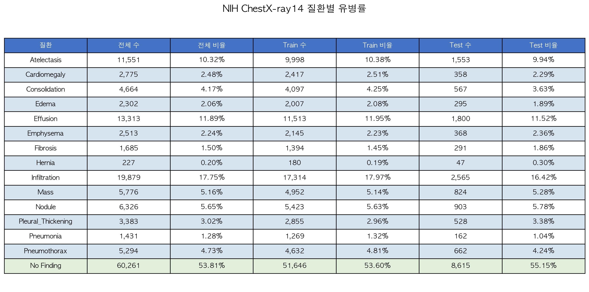

전체 데이터에서 약 53.8%가 No Finding(정상)이며, 가장 흔한 질환은 Infiltration(17.7%), Effusion(11.9%)이다. Hernia(0.2%)가 가장 희귀하여 심한 **클래스 불균형**이 존재한다.

### 1.3 Co-occurrence Matrix

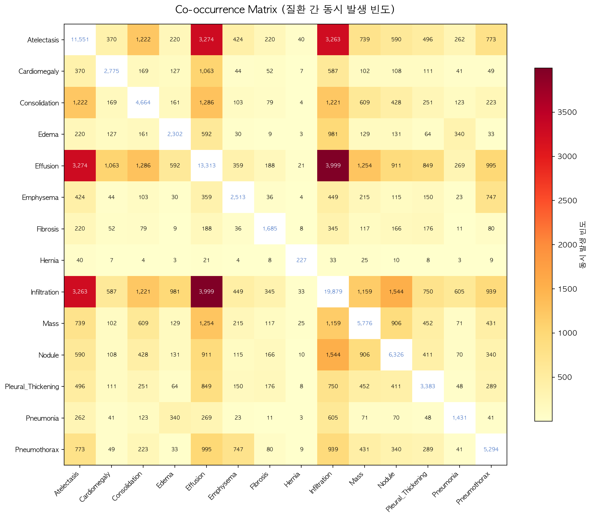

대각선은 각 질환의 단독 발생 수, 비대각선은 두 질환의 동시 발생 빈도를 나타낸다. Infiltration-Atelectasis, Infiltration-Effusion 조합이 가장 빈번하게 동시 발생하며, 이는 Multi-label Classification에서 질환 간 상관관계를 고려해야 함을 시사한다.

### 1.4 데이터 불균형 분석

- 가장 많은 질환(Infiltration): 19,894장 (17.7%)
- 가장 적은 질환(Hernia): 227장 (0.2%)
- 비율 차이: **약 88배**

이러한 불균형은 학습 시 `pos_weight` 적용과 Focal Loss를 통해 대응한다.

---

## 2. DICOM 파싱 및 PHI 처리

### 2.1 pydicom 파싱 결과

pydicom 내장 CT 샘플 파일을 사용하여 DICOM 메타데이터 파싱을 시연하였다.

```python
import pydicom
from pydicom import examples

ds = examples.ct
print(ds.PatientName)    # CompressedSamples^CT1
print(ds.PatientID)      # 1CT1
print(ds.Modality)       # CT
print(ds.Rows, ds.Columns)  # 128 128
print(ds.pixel_array.shape)  # (128, 128)
```

주요 메타데이터 파싱 결과:

| 필드 | 값 |
|------|------|
| Patient Name | CompressedSamples^CT1 |
| Patient ID | 1CT1 |
| Modality | CT |
| Institution Name | JFK IMAGING CENTER |
| Rows × Columns | 128 × 128 |
| Bits Allocated | 16 |

### 2.2 PHI 제거 원칙

DICOM 파일에는 환자 개인식별정보(PHI)가 포함되어 있어, 연구 사용 시 반드시 제거해야 한다.

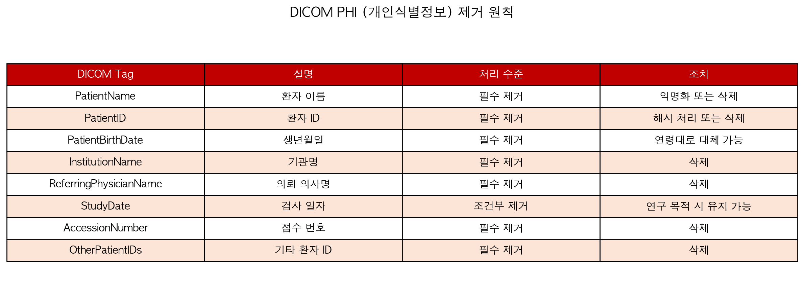

### 2.3 본 프로젝트 적용

NIH ChestX-ray14 데이터셋은 배포 시점에서 이미 **PNG 포맷으로 변환**되어 있으며, DICOM 메타데이터 중 PHI에 해당하는 필드는 제거된 상태이다. `Data_Entry_2017.csv`에 포함된 Patient ID는 익명화된 숫자 ID이며, 실제 환자를 식별할 수 없다.

따라서 본 프로젝트에서는:
1. 원본 데이터의 PHI 부재를 확인하였다.
2. 전처리/학습 과정에서 추가적인 개인정보를 생성하지 않았다.
3. 비공개 저장 금지 원칙을 준수하였다.

---

## 3. 이미지 전처리

### 3.1 CLAHE 적용

CLAHE(Contrast Limited Adaptive Histogram Equalization)는 지역적 대비를 개선하는 기법으로, X-ray 영상에서 폐 병변의 시인성을 향상시킨다.

**적용 파라미터:**
- `clipLimit`: 2.0
- `tileGridSize`: (8, 8)

```python
import cv2
clahe = cv2.createCLAHE(clipLimit=2.0, tileGridSize=(8, 8))
enhanced = clahe.apply(grayscale_image)
```

### 3.2 병변 시인성 변화 분석

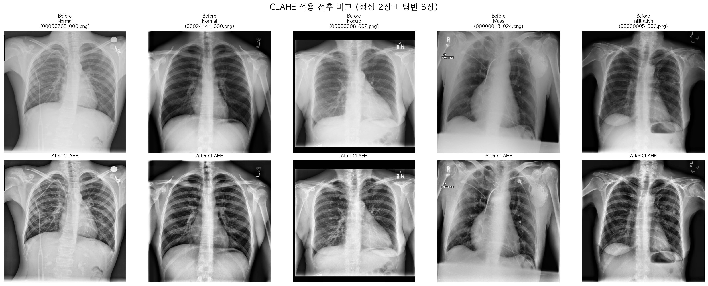

정상 이미지(1-2열)에서는 폐 경계와 혈관 구조가 더 선명해졌으며, 병변 이미지(3-5열)에서는:
- **Nodule**: 결절의 경계가 뚜렷해져 위치 식별이 용이
- **Mass**: 종괴 영역과 주변 조직 간의 대비 향상
- **Infiltration**: 침윤 패턴이 더 명확하게 구분

### 3.3 히스토그램 비교

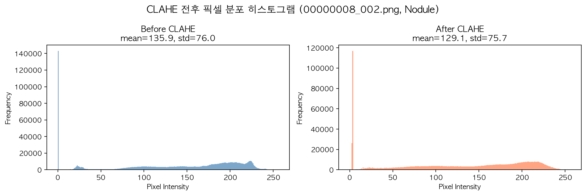

CLAHE 적용 후 픽셀 분포가 더 균일해져, 동적 범위가 확대되었음을 확인할 수 있다. 이는 모델이 더 풍부한 특징을 학습할 수 있게 한다.

### 3.4 Resize 및 채널 처리

- **Resize**: 224×224 (Bilinear Interpolation)
  - DenseNet-121, EfficientNet 등 ImageNet Pretrained 모델의 표준 입력 크기
- **채널 복제**: Grayscale(1채널) → RGB(3채널) 복제
  - ImageNet Pretrained 모델은 3채널 입력을 기대하므로 동일 값을 3채널로 복제

### 3.5 ImageNet 정규화

```python
mean = [0.485, 0.456, 0.406]
std  = [0.229, 0.224, 0.225]
```

ImageNet 학습 데이터의 평균과 표준편차로 정규화하여, Pretrained 가중치와의 호환성을 확보하였다. 정규화는 저장 시 적용하지 않고 DataLoader에서 실시간 적용한다.

### 3.6 전처리 파이프라인 순서도

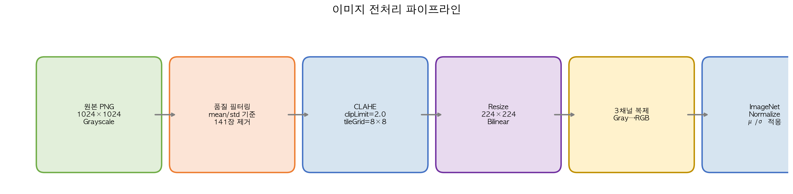

---

## 4. 이미지 품질 필터링

### 4.1 필터링 기준 설정 과정

전체 112,120장에 대해 평균 밝기(mean intensity)와 표준편차(std)를 산출하여 `all_image_stats.csv`에 기록하였다. 이를 바탕으로 다음 기준을 설정하였다.

| 기준 | 의미 |
|------|------|
| mean < 50 | 과도한 검은 여백이 포함된 이미지 |
| mean > 195 | 과도한 흰 여백이 포함된 이미지 |
| std < 25 (CLAHE 후) | CLAHE 적용 후에도 대비가 부족한 이미지 |

### 4.2 필터링 결과 요약

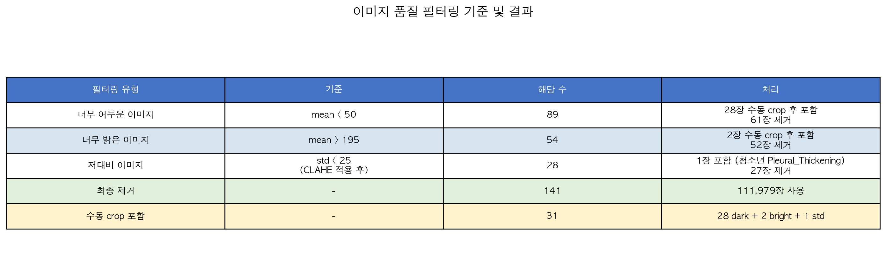

총 **141장 제거**, **31장 수동 crop 후 포함**, 최종 **111,979장** 사용.

### 4.3 소아 표본 보존 분석

단순히 기준 이하 이미지를 제거하면 소아(0-18세) 희귀 질환 표본이 치명적으로 감소하는 문제를 발견하였다.

**나이대별 분포:**
- 0-1세(신생아): 16장
- 1-2세(영아): 83장
- 2-6세(유아): 529장
- 6-12세(학령기): 1,875장
- 12-18세(청소년): 3,438장

mean < 50 이미지 89장 중 **82장이 소아**였으며, 이는 소아 X-ray 촬영 특성상 검은 여백이 많이 포함되기 때문이다.

**나이대×질환 교차 분석 결과:**

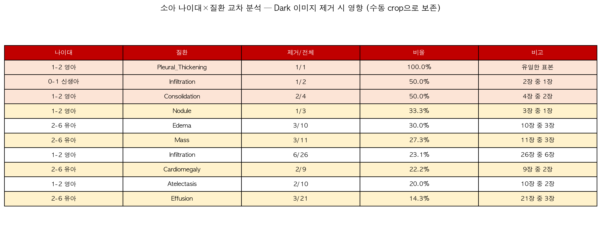

영아 Pleural_Thickening(1/1, 100%), 신생아 Infiltration(1/2, 50%) 등 제거 시 해당 조합의 표본이 소멸하거나 절반이 사라지는 치명적 결과가 예상되었다.

**의사결정:** 소아 희귀 질환 28장 + 밝은 이미지 2장 + 저대비 1장 = **31장**에 대해 수동 crop 후 포함하기로 결정.

### 4.4 수동 Crop 처리

**알고리즘:**
1. Dark 이미지(mean < 50): threshold(15) → contour detection → bounding box → 1:1 center crop
2. Bright 이미지(mean > 195): 반전(255 - image) → 동일 알고리즘 적용
3. 자동 crop 결과를 전수 수동 검증 후 승인

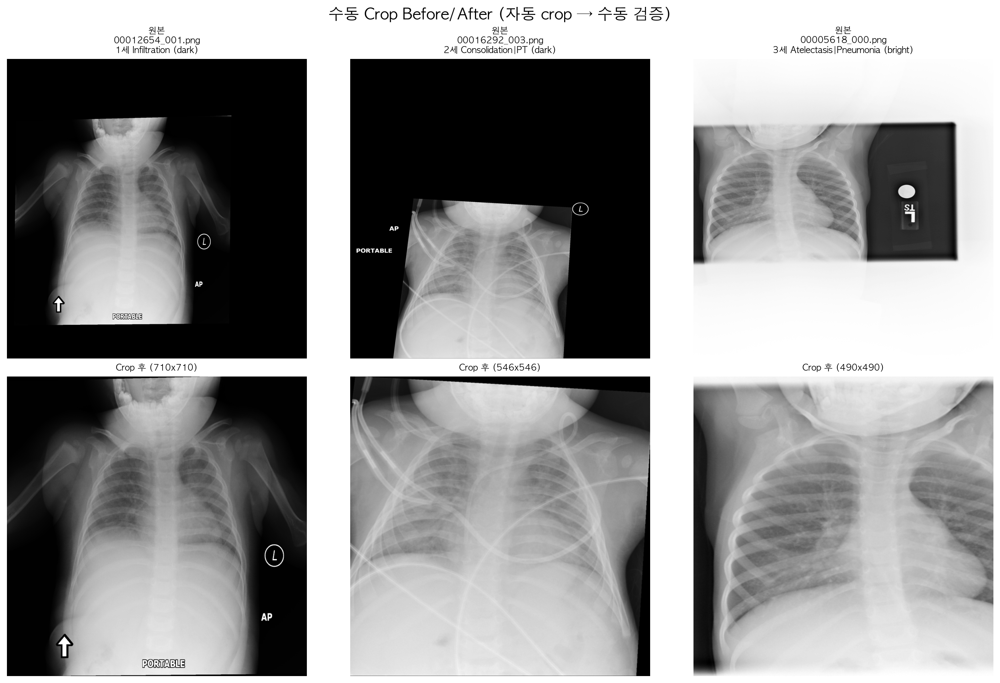

의료 데이터의 특성상 완전 자동화보다 **"자동 crop + 수동 검증"** 방식을 채택하여 신뢰성을 확보하였다. 30장이라는 소규모이므로 수동 검수 비용이 낮았다.

### 4.5 최종 필터링 파이프라인

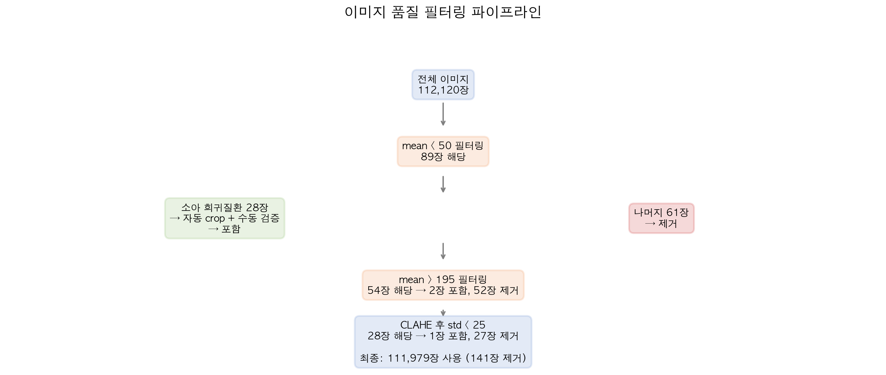

---

## 5. Multi-hot Encoding

### 5.1 14개 질환 목록 (알파벳순 인덱스)

| Index | 질환명 |
|-------|--------|
| 0 | Atelectasis |
| 1 | Cardiomegaly |
| 2 | Consolidation |
| 3 | Edema |
| 4 | Effusion |
| 5 | Emphysema |
| 6 | Fibrosis |
| 7 | Hernia |
| 8 | Infiltration |
| 9 | Mass |
| 10 | Nodule |
| 11 | Pleural_Thickening |
| 12 | Pneumonia |
| 13 | Pneumothorax |

### 5.2 변환 규칙 및 예시

Finding Labels 컬럼에서 `|`로 구분된 질환명을 파싱하여, 해당 인덱스를 1로 설정한다.


### 5.3 No Finding 처리

`No Finding`은 14개 질환이 모두 없음을 의미하므로, 벡터를 `[0,0,0,...,0]`(전부 0)으로 설정한다. 별도의 15번째 클래스로 분리하지 않는다.

### 5.4 검증 결과

```
============================================================
Multi-hot Encoding 정합성 검증
============================================================
전체 이미지 수: 111,979

[검증 1] Finding Labels vs 벡터 합 불일치: 0건
[검증 2] No Finding인데 벡터 합 > 0: 0건
[검증 3] 0/1이 아닌 값: 0건

>>> 모든 검증 통과 - Encoding 정합성 확인 완료
```

---

## 6. 데이터 분할

### 6.1 Patient-wise 분할 원칙

동일 환자의 서로 다른 시점 촬영 이미지가 Train과 Test에 나뉘면 **Data Leakage**가 발생한다. 이를 방지하기 위해 모든 분할은 **Patient ID 기준**으로 수행하였다.

### 6.2 Train/Test 분할 결과

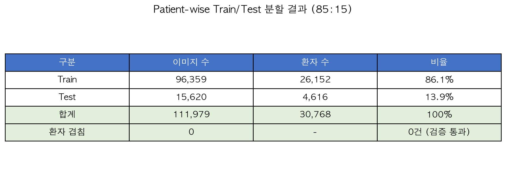

- 분할 비율: 85:15
- **환자 겹침: 0건** (검증 통과)

### 6.3 5-Fold GroupKFold 결과

Train 세트 내에서 5-Fold GroupKFold를 적용하여 교차 검증을 수행한다. 각 fold의 validation set에 해당하는 환자가 다른 fold의 training set에 포함되지 않음을 보장한다.

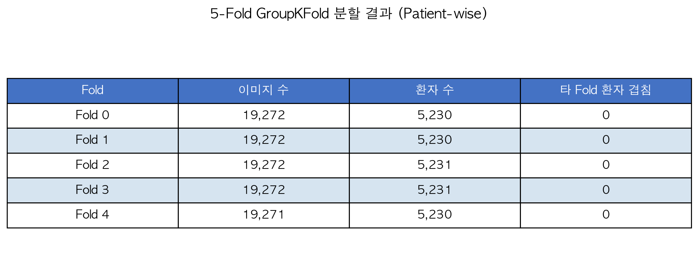

- 5개 fold 모두 **환자 겹침 0건**
- 각 fold 약 19,272장, 5,230~5,231명 환자로 균등 분배

### 6.4 Fold별 질환 분포 균일성

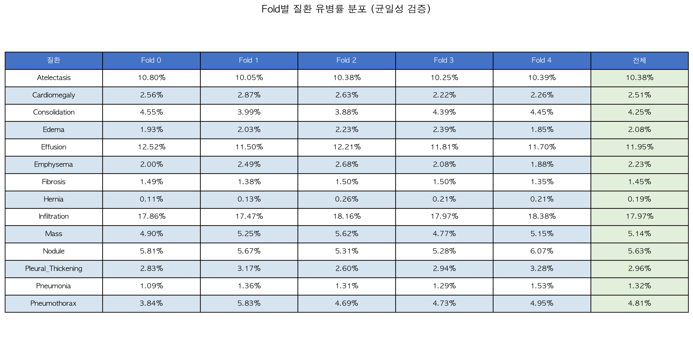

각 fold의 질환별 유병률이 전체 분포와 유사하여, fold 간 **질환 분포의 편향 없이** 균일하게 분할되었음을 확인하였다.

---

## 부록: 전처리 데이터셋 정보

- **저장 위치**: HuggingFace `MouGam/nih-processed-dataset`
- **이미지 규격**: 224×224, RGB (3채널), PNG
- **총 available 이미지**: 111,979장
- **총 unavailable 이미지**: 141장
- **Train**: 96,359장 (26,152 patients, fold 0~4)
- **Test**: 15,620장 (4,616 patients)
