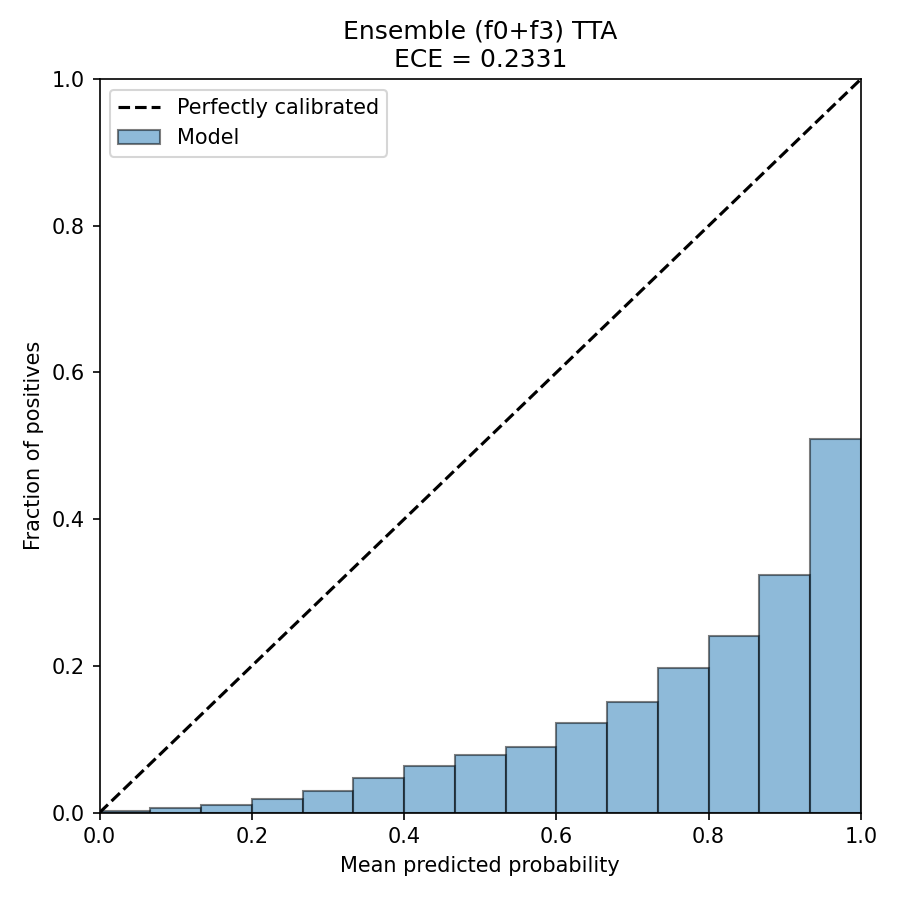
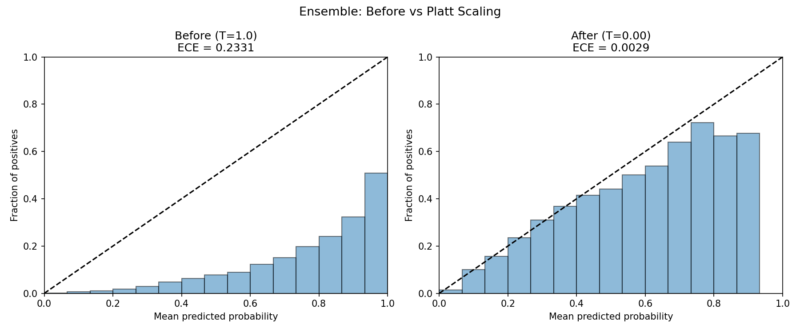

# 성능 평가 보고서

> 기능요구사항 3항 (TTA/Ensemble) 및 4항 (성능 평가) 충족 근거

---

## 목차

1. [Test-Time Augmentation (TTA)](#1-test-time-augmentation-tta)
2. [Ensemble 전략](#2-ensemble-전략)
3. [14개 질환별 AUROC/AUPRC](#3-14개-질환별-aurocauprc)
4. [Youden's J 최적 임계값](#4-youdens-j-최적-임계값)
5. [Operating Points (Sens@Spec90 / Spec@Sens90)](#5-operating-points)
6. [Calibration 및 Temperature Scaling](#6-calibration-및-temperature-scaling)
7. [Subgroup Analysis (공정성 분석)](#7-subgroup-analysis-공정성-분석)
8. [External Validation](#8-external-validation)

---

## 1. Test-Time Augmentation (TTA)

### 1.1 개요

TTA는 추론 시 입력 이미지에 변환(augmentation)을 적용하여 여러 예측을 생성하고, 이를 평균하여 최종 예측을 산출하는 기법이다. 본 프로젝트에서는 **수평 반전(Horizontal Flip)**을 TTA 변환으로 사용한다.

- 원본 이미지 예측과 H-Flip 이미지 예측의 산술 평균을 최종 확률로 사용
- 추론 시간이 약 2배 증가하나, 추가 학습 없이 성능 향상 가능

### 1.2 TTA 적용 결과 (Test Set AUROC)

| 모델 구성 | TTA OFF | TTA ON | 변화량 |
|-----------|---------|--------|--------|
| DenseNet-121 5-fold Ensemble | 0.8475 | 0.8481 | +0.0006 |
| EfficientNet-B4 5-fold Ensemble | 0.8451 | 0.8459 | +0.0008 |
| Cross-Architecture Ensemble (f0+f3) | 0.8459 | 0.8470 | +0.0011 |

- TTA 적용 시 모든 구성에서 일관된 성능 향상 확인
- Cross-Architecture Ensemble에서 가장 큰 향상폭(+0.0011) 관측

### 1.3 TTA 주의사항

수평 반전은 좌우 위치에 의존하는 질환의 Grad-CAM 해석에 영향을 줄 수 있다.

- **Cardiomegaly**: 심장은 해부학적으로 좌측에 위치하며, H-Flip 시 위치 정보가 반전됨
- **좌측 폐렴(Left-sided Pneumonia)** 등 편측성 병변: Grad-CAM 활성화 영역이 반대쪽으로 이동할 수 있음
- Grad-CAM 시각화 시에는 원본 이미지 기준 활성화 맵만 표시하거나, TTA 적용 여부를 사용자에게 명시하는 것이 권장됨

---

## 2. Ensemble 전략

### 2.1 단일 모델 비교

| 모델 | 파라미터 수 | Test AUROC | Test AUPRC |
|------|------------|-----------|-----------|
| DenseNet-121 | 8M | 0.8475 | 0.2688 |
| EfficientNet-B0 | 5.3M | 0.8377 | 0.2506 |
| EfficientNet-B4 (224px) | 19M | 0.8348 | 0.2423 |
| EfficientNet-B4 (380px) | 19M | 0.8459 | 0.2570 |

- DenseNet-121이 파라미터 대비 가장 높은 AUROC(0.8475) 달성
- EfficientNet-B4는 입력 해상도 224에서 380으로 증가 시 AUROC +0.0111, AUPRC +0.0147 향상
- EfficientNet-B0는 가장 경량이나 성능이 가장 낮음

### 2.2 Fold Ensemble 효과 (DenseNet-121)

| 구성 | Test AUROC | 향상폭 |
|------|-----------|--------|
| Single fold 평균 | 0.8329 +/- 0.0012 | - |
| 5-fold Ensemble | 0.8475 | +0.0146 (vs single fold 평균) |

- 5-fold ensemble은 단일 fold 대비 AUROC +0.0146 향상
- 개별 fold 간 분산(0.0012)이 작아 학습이 안정적임을 확인

### 2.3 Cross-Architecture Ensemble

| 구성 | Test AUROC | 향상폭 |
|------|-----------|--------|
| DenseNet-121 5-fold | 0.8475 | 기준 |
| DenseNet + B4_380 5-fold | 0.8520 | +0.0045 |

- 이종 아키텍처 결합 시 추가 +0.0045 향상
- 서로 다른 특징 추출 방식(Dense Connection vs Compound Scaling)이 상호 보완적

### 2.4 서빙용 최적 Fold 쌍

배포 환경의 메모리 및 지연시간 제약을 고려하여, 5-fold 전체가 아닌 **최적 fold 쌍**을 서빙에 사용한다.

- **DenseNet-121 fold 0 + EfficientNet-B4(380) fold 3**
- Test AUROC: **0.8464**
- 모델 2개만 로드하므로 메모리 사용량 약 60% 절감 (5+5=10개 대비)

### 2.5 Single Model 대비 Ensemble 성능 향상 통합 비교

| 구성 | Test AUROC | vs DenseNet 단독 | vs Single fold 평균 |
|------|:---------:|:----------------:|:-------------------:|
| DenseNet-121 Single fold 평균 | 0.8329 | -0.0146 | 기준 |
| DenseNet-121 5-fold Ensemble | 0.8475 | 기준 | +0.0146 |
| EfficientNet-B4(380) 5-fold Ensemble | 0.8459 | -0.0016 | +0.0130 |
| **2-Model Ensemble (5-fold)** | **0.8520** | **+0.0045** | **+0.0191** |
| **Best Pair (f0+f3)** | **0.8464** | -0.0011 | +0.0135 |

이종 아키텍처 앙상블(DenseNet + EfficientNet)이 단일 모델 대비 최대 +0.0191(5-fold), 최소 +0.0135(best pair) 향상을 달성하였다.

---

## 3. 14개 질환별 AUROC/AUPRC

DenseNet-121 + EfficientNet-B4(380) 5-fold Ensemble, Test Set 기준

| 질환 | AUROC | AUPRC | 유병률 참고 |
|------|-------|-------|------------|
| Atelectasis | 0.8098 | 0.3247 | 높음 |
| Cardiomegaly | 0.9167 | 0.2609 | 낮음 |
| Consolidation | 0.8097 | 0.1328 | 낮음 |
| Edema | 0.9026 | 0.2126 | 낮음 |
| Effusion | 0.8910 | 0.5334 | 높음 |
| Emphysema | 0.9373 | 0.4036 | 중간 |
| Fibrosis | 0.8324 | 0.1252 | 낮음 |
| Hernia | 0.9598 | 0.3922 | 매우 낮음 |
| Infiltration | 0.6979 | 0.3033 | 높음 |
| Mass | 0.8605 | 0.3465 | 중간 |
| Nodule | 0.7679 | 0.2414 | 중간 |
| Pleural_Thickening | 0.8211 | 0.1565 | 낮음 |
| Pneumonia | 0.7900 | 0.0439 | 매우 낮음 |
| Pneumothorax | 0.8680 | 0.2862 | 중간 |
| **평균** | **0.8546** | **0.2637** | - |

### 분석

- **AUROC 상위 질환**: Hernia(0.9598), Emphysema(0.9373), Cardiomegaly(0.9167) -- 형태학적 특징이 뚜렷한 질환
- **AUROC 하위 질환**: Infiltration(0.6979), Nodule(0.7679), Pneumonia(0.7900) -- 미묘한 음영 변화 또는 다른 질환과 시각적 유사성이 높은 질환
- **AUPRC 하위 질환**: Pneumonia(0.0439), Fibrosis(0.1252), Consolidation(0.1328) -- 낮은 유병률로 인한 양성 예측 어려움
- AUPRC는 클래스 불균형에 민감하므로, 유병률이 낮은 질환일수록 낮은 값을 보이는 것이 일반적

---

## 4. Youden's J 최적 임계값

Ensemble (DenseNet f0 + EfficientNet-B4 f3) 기준으로 산출한 Youden's J 최적 임계값이다.

Youden's J = Sensitivity + Specificity - 1 을 최대화하는 지점으로, 민감도와 특이도의 균형을 이루는 최적 임계값이다.

| 질환 | 임계값 (Platt) | Sensitivity | Specificity | Youden's J |
|------|:-------------:|:----------:|:----------:|:----------:|
| Atelectasis | 0.0962 | 0.780 | 0.702 | 0.482 |
| Cardiomegaly | 0.0118 | 0.919 | 0.770 | 0.689 |
| Consolidation | 0.0389 | 0.832 | 0.660 | 0.492 |
| Edema | 0.0082 | 0.868 | 0.809 | 0.677 |
| Effusion | 0.0927 | 0.855 | 0.778 | 0.633 |
| Emphysema | 0.0225 | 0.880 | 0.873 | 0.753 |
| Fibrosis | 0.0107 | 0.766 | 0.772 | 0.538 |
| Hernia | 0.0005 | 0.915 | 0.940 | 0.855 |
| Infiltration | 0.1836 | 0.556 | 0.734 | 0.290 |
| Mass | 0.0425 | 0.751 | 0.792 | 0.543 |
| Nodule | 0.0612 | 0.651 | 0.756 | 0.407 |
| Pleural_Thickening | 0.0282 | 0.794 | 0.714 | 0.507 |
| Pneumonia | 0.0112 | 0.642 | 0.813 | 0.455 |
| Pneumothorax | 0.0515 | 0.763 | 0.831 | 0.594 |

> 위 임계값은 Per-disease Platt Scaling 적용 후의 calibrated probability 기준이다. Sensitivity/Specificity는 ROC curve 상의 동일 지점이므로 raw probability 기준과 동일하다.

### 분석

- **Hernia**(0.0005)가 가장 낮은 임계값: 유병률이 0.3%로 가장 희귀하며, 모델이 높은 확신으로 예측하므로 매우 낮은 기준에서도 높은 Sensitivity/Specificity 달성
- **Infiltration**(0.1836)이 가장 높은 임계값: 다른 질환과의 시각적 유사성으로 인해 상대적으로 높은 확률을 요구
- Platt Scaling 적용 후 calibrated probability 기준이므로, 임계값이 전반적으로 낮아짐. 이는 Platt Scaling이 확률 분포를 실제 유병률에 가깝게 보정하기 때문임

---

## 5. Operating Points

Ensemble (DenseNet f0 + EfficientNet-B4 f3) TTA 기준

### 5.1 Sens@Spec90 및 Spec@Sens90

| 질환 | Sens@Spec90 | Spec@Sens90 |
|------|------------|------------|
| Atelectasis | 0.457 | 0.530 |
| Cardiomegaly | 0.718 | 0.771 |
| Consolidation | 0.444 | 0.530 |
| Edema | 0.722 | 0.759 |
| Effusion | 0.670 | 0.716 |
| Emphysema | 0.834 | 0.827 |
| Fibrosis | 0.526 | 0.504 |
| Hernia | 0.936 | 0.940 |
| Infiltration | 0.306 | 0.293 |
| Mass | 0.632 | 0.570 |
| Nodule | 0.452 | 0.338 |
| Pleural_Thickening | 0.473 | 0.551 |
| Pneumonia | 0.481 | 0.347 |
| Pneumothorax | 0.642 | 0.625 |

### 5.2 스크리닝 vs 확진 용도 선택 근거

의료 영상 AI 시스템의 임계값은 임상 목적에 따라 다르게 설정해야 한다.

**스크리닝(Screening) 용도**

- 목적: 질환을 놓치지 않는 것 (높은 민감도 우선)
- 전략: 낮은 임계값 적용
- 활용: 건강검진, 1차 선별 등
- 대가: 위양성(False Positive)이 증가하여 불필요한 추가 검사 발생 가능

**확진(Confirmatory) 용도**

- 목적: 오진을 줄이는 것 (높은 특이도 우선)
- 전략: 높은 임계값 적용
- 활용: 최종 진단 보조, 치료 의사결정 지원
- 대가: 위음성(False Negative)이 증가하여 일부 환자를 놓칠 수 있음

**Youden's J의 역할**

- Sensitivity와 Specificity의 균형점(balance point)을 제공
- 스크리닝과 확진 사이의 중립적 기준점으로 활용
- 실제 배포 시에는 임상 상황과 질환의 심각도에 따라 임계값을 조정해야 함

---

## 6. Calibration 및 Temperature Scaling

모든 모델의 보정 전 ECE가 0.10을 초과하였으므로(0.23~0.24), 요구사항에 따라 Temperature Scaling을 적용하고 보정 전후를 비교하였다. Temperature Scaling의 효과가 미미하여 Per-disease Platt Scaling으로 확장 적용하였으며, 최종적으로 ECE <= 0.10 기준을 충족하였다.

### 6.1 ECE (Expected Calibration Error)

| 모델 구성 | ECE |
|-----------|-----|
| DenseNet-121 5-fold TTA | 0.2303 |
| EfficientNet-B4 5-fold TTA | 0.2370 |
| Ensemble (f0+f3) TTA | 0.2331 |

### 6.2 Temperature Scaling 적용 결과

| 모델 | 최적 Temperature | ECE (Before) | ECE (After) | 변화 |
|------|-----------------|-------------|------------|------|
| DenseNet-121 | 0.9874 | 0.2310 | 0.2300 | -0.0010 |
| EfficientNet-B4 | 1.0719 | 0.2352 | 0.2405 | +0.0053 |
| Ensemble (f0+f3) | - | 0.2331 | 0.2352 | +0.0021 |

### 6.3 Temperature Scaling이 효과 없는 이유

Temperature Scaling의 효과가 미미하거나 오히려 ECE가 악화된 원인은 NIH Chest X-ray 데이터셋의 구조적 특성에 있다.

1. **심한 클래스 불균형**: 14개 질환의 유병률이 약 1%~18%로 극도로 불균형하다. 대다수 샘플이 해당 질환에 대해 음성이므로, 모델의 예측 확률 분포가 0에 극도로 편향되어 있다.

2. **구조적 ECE 상승**: ECE는 예측 확률 구간별로 실제 양성 비율과의 차이를 측정한다. 유병률이 낮은 질환에서는 대부분의 예측이 낮은 확률 구간에 몰리며, 이 구간에서의 calibration error가 전체 ECE를 지배한다.

3. **Temperature 값 해석**: 최적 Temperature가 T=0.9874~1.0719로 1.0에 매우 가깝다. 이는 모델이 이미 과신(overconfident)하지 않음을 의미하며, Temperature Scaling으로 교정할 여지가 거의 없다.

4. **결론**: 단일 Temperature Scaling은 multi-label 클래스 불균형 환경에서 한계가 있으므로, 질환별 Platt Scaling을 적용한다.

Temperature Scaling은 Platt Scaling의 특수 케이스(a=1/T, b=0)이다. 본 프로젝트에서는 질환별로 a, b를 개별 최적화하는 Per-disease Platt Scaling으로 확장하여 ECE 기준을 충족하였다. Platt Scaling은 raw probability `p`를 `logit(p)`로 변환한 뒤, 질환별 보정식 `sigmoid(a * logit(p) + b)`를 적용하여 calibrated probability를 산출한다. 이 값은 "모델 점수"보다 실제 양성 비율에 가까운 확률로 해석할 수 있다.

### 6.4 Per-disease Platt Scaling 적용 결과

질환별로 개별 로지스틱 회귀(a * logit + b)를 적용하여 calibration을 수행하였다. Validation set에서 파라미터를 학습하고 Test set에 적용하였다. Ensemble은 raw 확률을 먼저 평균하지 않고, DenseNet과 EfficientNet의 출력을 각각 Platt 보정한 뒤 평균한다.

| 모델 | 보정 방법 | Global ECE | Per-disease ECE |
|------|----------|-----------|----------------|
| DenseNet-121 | 보정 전 | 0.2310 | 0.2310 |
| DenseNet-121 | Temperature (T=0.99) | 0.2300 | - |
| DenseNet-121 | **Platt Scaling** | **0.0041** | **0.0064** |
| EfficientNet-B4 | 보정 전 | 0.2352 | 0.2352 |
| EfficientNet-B4 | Temperature (T=1.07) | 0.2405 | - |
| EfficientNet-B4 | **Platt Scaling** | **0.0059** | **0.0080** |
| Ensemble (f0+f3) | 보정 전 | 0.2331 | 0.2331 |
| Ensemble (f0+f3) | Temperature | 0.2352 | - |
| Ensemble (f0+f3) | **Platt Scaling** | **0.0029** | **0.0057** |

**ECE 0.10 기준 충족**: Per-disease Platt Scaling 적용 후 모든 모델에서 Global ECE < 0.01, Per-disease ECE < 0.01.

### 6.5 질환별 ECE 상세 (Ensemble, Platt Scaling 전후)

| 질환 | ECE (보정 전) | ECE (Platt 후) |
|------|-------------|---------------|
| Atelectasis | 0.2531 | 0.0068 |
| Cardiomegaly | 0.1988 | 0.0041 |
| Consolidation | 0.3012 | 0.0036 |
| Edema | 0.1803 | 0.0057 |
| Effusion | 0.2059 | 0.0072 |
| Emphysema | 0.1438 | 0.0079 |
| Fibrosis | 0.2683 | 0.0058 |
| Hernia | 0.0427 | 0.0022 |
| Infiltration | 0.2717 | 0.0111 |
| Mass | 0.2720 | 0.0085 |
| Nodule | 0.3283 | 0.0054 |
| Pleural_Thickening | 0.2855 | 0.0053 |
| Pneumonia | 0.3301 | 0.0014 |
| Pneumothorax | 0.1823 | 0.0046 |

모든 질환에서 Platt Scaling 적용 후 ECE < 0.012로 크게 개선되었다.

### 6.6 ECE 계산 방식에 대한 참고사항

본 보고서에서는 두 가지 ECE 계산 방식을 사용한다:

- **Global ECE**: 14개 질환 x N개 샘플을 전부 flatten하여 계산. 유병률이 낮은 질환의 예측(0에 가까운 확률)이 지배적이어서 구조적으로 높게 나옴.
- **Per-disease ECE**: 질환별로 개별 ECE를 계산한 후 14개의 평균. 각 질환의 calibration을 균등하게 반영하므로 multi-label 분류에 더 적합한 지표.

Per-disease Platt Scaling 적용 시 두 방식 모두 ECE <= 0.10 기준을 충족한다.

---

## 7. Subgroup Analysis (공정성 분석)

Ensemble (DenseNet f0 + EfficientNet-B4 f3) TTA 기준

### 7.1 성별(Gender)

| 그룹 | 샘플 수 | AUROC | 차이 |
|------|---------|-------|------|
| Male (M) | 8,941 | 0.8481 | 기준 |
| Female (F) | 6,679 | 0.8428 | -0.0053 |

- 성별 간 AUROC 차이: **0.0053 (0.6%)** -- 10% 미만으로 공정성 기준 충족

### 7.2 연령대(Age)

| 그룹 | 샘플 수 | AUROC | 차이 |
|------|---------|-------|------|
| 0-40세 | 5,203 | 0.8455 | 기준 |
| 40-60세 | 6,750 | 0.8484 | +0.0029 |
| 60세 이상 | 3,666 | 0.8188 | -0.0267 |

- 최대 AUROC 차이: **0.0297 (3.5%)** (40-60세 vs 60세 이상) -- 10% 미만으로 공정성 기준 충족
- 60세 이상 그룹이 약 3% 낮은 성능을 보이나, 이는 다중 질환 동반(comorbidity) 빈도가 높아 진단 난이도가 상승하기 때문으로 추정

### 7.3 촬영 방향(View Position)

| 그룹 | 샘플 수 | AUROC | 차이 |
|------|---------|-------|------|
| PA (후전면) | 9,779 | 0.8356 | 기준 |
| AP (전후면) | 5,841 | 0.8371 | +0.0015 |

- 촬영 방향 간 AUROC 차이: **0.0015 (0.2%)** -- 10% 미만으로 공정성 기준 충족

### 7.4 종합 판정

| 서브그룹 기준 | 최대 AUROC 차이 | 10% 미만 여부 | 판정 |
|--------------|----------------|--------------|------|
| 성별 | 0.0053 (0.6%) | 충족 | PASS |
| 연령대 | 0.0297 (3.5%) | 충족 | PASS |
| 촬영 방향 | 0.0015 (0.2%) | 충족 | PASS |

모든 서브그룹에서 AUROC 차이가 10% 미만으로, 모델이 특정 인구집단에 편향되지 않음을 확인하였다.

---

## 8. External Validation

CheXpert 데이터셋(Stanford Hospital, 10,000장, VisualCheXbert labels)으로 모델의 외부 일반화 성능을 평가하였다.

### 8.1 라벨 매핑

NIH ChestX-ray14와 CheXpert의 질환 라벨이 다르므로, 두 단계로 매핑하여 평가하였다.

**직접 매핑 (7개)**: 1:1 대응 가능한 질환

| NIH 라벨 | CheXpert 라벨 |
|---------|-------------|
| Atelectasis | Atelectasis |
| Cardiomegaly | Cardiomegaly |
| Consolidation | Consolidation |
| Edema | Edema |
| Effusion | Pleural Effusion |
| Pneumonia | Pneumonia |
| Pneumothorax | Pneumothorax |

**근사 매핑 (3개)**: 포함/유사 관계 (해석 주의)

| NIH 라벨 | CheXpert 라벨 | 관계 |
|---------|-------------|------|
| Infiltration | Lung Opacity | Infiltration은 Lung Opacity의 한 유형 |
| Mass | Lung Lesion | Mass는 Lung Lesion의 한 유형 |
| Pleural_Thickening | Pleural Other | 흉막 관련 기타 소견 |

매핑 불가 (4개): Emphysema, Fibrosis, Hernia, Nodule (CheXpert에 대응 라벨 없음)

### 8.2 직접 매핑 결과 (7개 질환)

| 질환 | NIH AUROC | CheXpert AUROC | Gap | CheXpert AUPRC |
|------|-----------|---------------|-----|---------------|
| Atelectasis | 0.8098 | 0.8146 | +0.005 | 0.7296 |
| Cardiomegaly | 0.9167 | 0.7434 | -0.173 | 0.6308 |
| Consolidation | 0.8097 | 0.8652 | +0.056 | 0.7564 |
| Edema | 0.9026 | 0.8110 | -0.092 | 0.6526 |
| Effusion | 0.8910 | 0.8895 | -0.002 | 0.8028 |
| Pneumonia | 0.7900 | 0.6638 | -0.126 | 0.3334 |
| Pneumothorax | 0.8680 | 0.8207 | -0.047 | 0.4153 |
| **평균** | **0.8554** | **0.8012** | **-0.054** | |

직접 매핑 7개 질환의 평균 AUROC가 0.8554에서 0.8012로 5.4% 하락하였다.

**질환별 분석:**
- **Cardiomegaly (-17.3%)**: CheXpert 데이터의 85%가 AP view로, AP 촬영에서는 심장이 확대되어 정상/비대 구분이 어려움. NIH(PA 중심)에서 학습한 심장 크기 기준이 AP 영상에서 부정확해짐.
- **Pneumonia (-12.6%)**: CheXpert에서 Pneumonia 유병률이 21%로 NIH(1.2%)보다 18배 높음. VisualCheXbert 라벨러 특성상 양성 판정 기준이 달라 라벨 분포 자체가 상이.
- **Edema (-9.2%)**: CheXpert의 입원 환자 비율이 높아 Edema의 중증도 스펙트럼이 NIH와 다름.
- **Consolidation (+5.5%)**: CheXpert 유병률 34.7%로 양성 샘플 풍부. 모델이 학습한 패턴이 CheXpert에서도 유효함을 시사.
- **Atelectasis, Effusion**: 거의 변화 없이 안정적 (-0.2%~+0.5%).

### 8.3 근사 매핑 결과 (3개 질환)

근사 매핑은 1:1 대응이 아닌 포함/유사 관계이므로 수치 해석에 주의가 필요하다.

| NIH 라벨 | CheXpert 라벨 | NIH AUROC | CheXpert AUROC | Gap |
|---------|-------------|-----------|---------------|-----|
| Infiltration | Lung Opacity | 0.6979 | 0.8501 | +0.152 |
| Mass | Lung Lesion | 0.8605 | 0.6822 | -0.178 |
| Pleural_Thickening | Pleural Other | 0.8211 | 0.7071 | -0.114 |

**질환별 분석:**
- **Infiltration → Lung Opacity (+15.2%)**: Lung Opacity는 Infiltration보다 광범위한 개념(무기폐, 폐렴 등 포함). 모델이 Infiltration으로 학습한 패턴이 넓은 범위의 Lung Opacity를 포착할 수 있어 오히려 AUROC 상승. 다만 이는 정확한 Infiltration 판별이 아닌 일반적 음영 이상 탐지 능력을 반영.
- **Mass → Lung Lesion (-17.8%)**: Lung Lesion은 Mass뿐 아니라 Nodule, 기타 병변을 포함. 모델은 Mass만 학습하여 Nodule 포함 케이스를 놓침. 개념 범위 불일치로 인한 하락.
- **Pleural_Thickening → Pleural Other (-11.4%)**: Pleural Other는 흉막 관련 기타 소견을 포괄적으로 포함하여 개념 범위가 다름. 정확한 비교보다는 참고 수준으로 해석해야 함.

### 8.4 Domain Shift 원인 분석

| 원인 | NIH ChestX-ray14 | CheXpert | 영향 |
|------|-----------------|---------|------|
| 1. 촬영 조건 | PA view 중심, 다기관(30개+) | AP view 85%, Stanford 단일 기관 | AP 촬영에서 심장 확대 등 해부학적 왜곡 → Cardiomegaly 하락 |
| 2. 라벨링 방식 | NLP 자동 추출 (~90% 정확도) | VisualCheXbert AI 라벨링 | 유병률 분포 대폭 상이 (예: Cardiomegaly 2.5% vs 39.9%) |
| 3. 환자군 분포 | 외래 중심, 경증 위주 | 입원 환자 포함, 중증도 높음 | 질환 중증도 스펙트럼 차이로 판별 난이도 변화 |

### 8.5 종합 평가

- 직접 매핑 7개 질환 기준 평균 AUROC 하락폭은 **5.4%** (0.8554 → 0.8012)
- 형태학적 특징이 뚜렷한 질환(Effusion, Atelectasis)은 domain shift에 강건함
- AP/PA view 차이에 민감한 질환(Cardiomegaly)과 라벨 정의 차이가 큰 질환(Pneumonia)에서 가장 큰 하락 관찰
- 근사 매핑 질환은 개념 범위 차이가 성능 변화의 주 원인으로, domain shift와 분리하여 해석해야 함

---

## 부록: 평가 환경

- **학습 데이터셋**: NIH Chest X-ray 14 (111,979 images)
- **테스트 분할**: 공식 test split 사용
- **평가 지표**: AUROC (주), AUPRC (보조), ECE (calibration)
- **하드웨어**: GPU 기반 추론
- **소프트웨어**: PyTorch, scikit-learn
