# 기능요구사항 5: 설명 가능 AI (Grad-CAM) 및 에러 분석 보고서

---

## 목차

1. [Grad-CAM 구현](#1-grad-cam-구현)
2. [False Positive 분석](#2-false-positive-분석-5건)
3. [False Negative 분석](#3-false-negative-분석-5건)
4. [폐 영역 이탈 분석](#4-폐-영역-이탈-분석-5건)
5. [Shortcut Learning 분석](#5-shortcut-learning-분석)
6. [에러 케이스 공통 패턴 및 개선 방향](#6-에러-케이스-공통-패턴-및-개선-방향)

---

## 1. Grad-CAM 구현

### 1.1 개요

Grad-CAM(Gradient-weighted Class Activation Mapping)은 CNN 기반 모델의 예측 근거를 시각적으로 설명하는 기법이다. 특정 클래스에 대한 예측에 기여한 이미지 영역을 히트맵으로 표시하여, 모델이 "어디를 보고" 판단했는지를 직관적으로 확인할 수 있다.

### 1.2 Target Layer

| 모델 | Target Layer | 설명 |
|------|-------------|------|
| DenseNet-121 | `features.denseblock4.denselayer16.conv2` | 마지막 Dense Block의 최종 Convolution Layer |
| EfficientNet-B4 | `features.8.0` | 최종 Feature Extraction Stage의 첫 번째 블록 |

두 모델 모두 분류기(Classifier) 직전의 마지막 Convolution Layer를 대상으로 하며, 이 위치에서 가장 고수준의 의미론적 특징(semantic feature)이 추출된다.

### 1.3 구현 방법

**단계 1: Hook 등록**

- **Forward Hook**: Target Layer의 순전파 출력(feature map)을 저장한다.
- **Backward Hook**: Target Layer에 대한 손실 함수의 역전파 기울기(gradient)를 저장한다.

**단계 2: 히트맵 생성**

1. 대상 클래스에 대한 출력값을 역전파(backward)하여 gradient를 계산한다.
2. Gradient를 공간 축(H, W)에 대해 Global Average Pooling하여 채널별 가중치(gradient weights)를 산출한다.
3. 가중치와 feature map을 채널별로 가중합(weighted sum)한다.
4. ReLU를 적용하여 양의 기여도만 남긴다.

```
히트맵 = ReLU( sum( gradient_weights x feature_maps ) )
```

**단계 3: 오버레이 생성**

- 히트맵을 원본 이미지 크기로 리사이즈한다.
- 히트맵을 [0, 1] 범위로 정규화한 뒤 컬러맵(JET)을 적용한다.
- 원본 이미지 40% + 히트맵 60% 비율로 오버레이한다.

---

## 2. False Positive 분석 (5건)

False Positive(FP)는 실제로는 해당 질환이 없으나 모델이 양성으로 예측한 케이스이다.

### 2.1 케이스 목록

| 번호 | 이미지 파일 | 질환 | 예측 확률 | 가장자리 비율 | Grad-CAM |
|------|------------|------|-----------|--------------|----------|
| FP#1 | 00018444_001.png | Atelectasis | 0.968 | 0.14 | 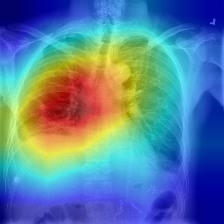 |
| FP#2 | 00021811_002.png | Atelectasis | 0.962 | 0.15 | 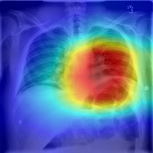 |
| FP#3 | 00013516_000.png | Atelectasis | 0.961 | 0.01 | 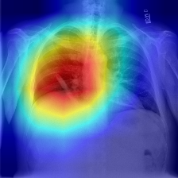 |
| FP#4 | 00000211_027.png | Cardiomegaly | 0.996 | 0.00 | 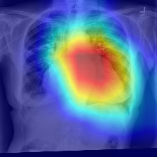 |
| FP#5 | 00000211_030.png | Cardiomegaly | 0.996 | 0.00 | 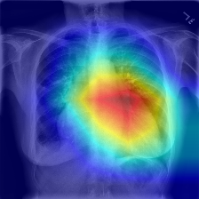 |

### 2.2 분석

**Atelectasis FP (FP#1 ~ FP#3)**

- 세 케이스 모두 예측 확률이 0.96 이상으로 매우 높은 확신도를 보인다.
- Grad-CAM 히트맵에서 폐 하부 영역에 집중된 활성화가 관찰된다.
- 경미한 폐 병변(예: 소량의 흉수, 폐 기저부 선상 음영)이 무기폐(Atelectasis)와 유사한 패턴을 보여 모델이 양성으로 판단한 것으로 추정된다.
- 가장자리 비율이 0.01~0.15로 낮아, 모델이 폐 영역 내부를 적절히 주목하고 있음을 확인할 수 있다.

**Cardiomegaly FP (FP#4 ~ FP#5)**

- 두 케이스 모두 동일 환자(00000211)의 연속 촬영 이미지이다.
- 예측 확률 0.996으로 거의 확정적인 예측을 보인다.
- 가장자리 비율이 0.00으로, 모델이 심장 영역을 정확히 주목하고 있다.
- 해당 환자의 심장 크기가 경계선(borderline)에 해당하여, 임상적으로도 판단이 모호한 케이스일 가능성이 높다.
- 동일 환자의 연속 촬영 이미지에서 반복적으로 FP가 발생하는 것은 환자 고유의 해부학적 특성이 원인으로 보인다.

**종합**: 대부분의 FP 케이스에서 가장자리 비율이 낮아 모델이 적절한 폐/심장 영역을 주목하고 있으나, 경계선 수준의 소견에서 판별력이 부족한 것으로 분석된다.

---

## 3. False Negative 분석 (5건)

False Negative(FN)는 실제로 해당 질환이 있으나 모델이 음성으로 예측한 케이스이다.

### 3.1 케이스 목록

| 번호 | 이미지 파일 | 질환 | 예측 확률 | 가장자리 비율 | Grad-CAM |
|------|------------|------|-----------|--------------|----------|
| FN#1 | 00003049_000.png | Atelectasis | 0.022 | 1.00 | 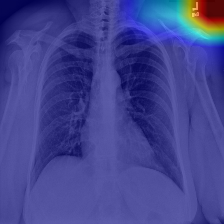 |
| FN#2 | 00028044_002.png | Atelectasis | 0.032 | 0.55 | 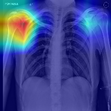 |
| FN#3 | 00001836_049.png | Atelectasis | 0.032 | 0.68 | 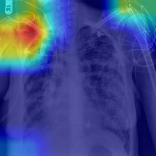 |
| FN#4 | 00017110_022.png | Cardiomegaly | 0.002 | 1.00 | 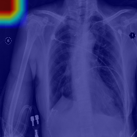 |
| FN#5 | 00026236_013.png | Cardiomegaly | 0.004 | 1.00 | 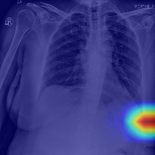 |

### 3.2 분석

**가장자리 비율이 매우 높음**

- FN 케이스 5건 중 3건에서 가장자리 비율이 1.00(100%)이며, 나머지 2건도 0.55, 0.68로 높은 수치를 보인다.
- 이는 모델이 폐 또는 심장 영역을 제대로 주목하지 못하고, 이미지 가장자리(뼈, 횡격막, 의료기기 부위)에 활성화가 분산되어 있음을 의미한다.

**매우 낮은 예측 확률**

- 모든 FN 케이스에서 예측 확률이 0.002~0.032 범위로, 모델이 해당 질환의 특징을 전혀 포착하지 못하고 있다.
- 이는 단순히 임계값(threshold) 조정으로 해결할 수 없는 수준의 근본적인 인식 실패를 나타낸다.

**가능 원인**

| 원인 | 설명 |
|------|------|
| 미세한 병변 | 병변의 크기가 매우 작아 224px 해상도에서 유의미한 특징이 추출되지 않음 |
| 다중 질환 공존 | 여러 질환이 동시에 존재하는 이미지에서 개별 질환의 패턴이 혼재되어 분리가 어려움 |
| 이미지 품질 | 촬영 조건(포지셔닝, 노출)에 따른 이미지 품질 저하가 특징 추출을 방해 |
| 비전형적 소견 | 교과서적이지 않은 비전형적 형태의 병변이 학습 분포에서 벗어남 |

---

## 4. 폐 영역 이탈 분석 (5건)

폐 영역 이탈(Outside Lung Field) 케이스는 Grad-CAM 활성화가 폐 영역 바깥에 집중된 경우이다.

### 4.1 케이스 목록

| 번호 | 이미지 파일 | 질환 | 예측 확률 | 가장자리 비율 | Grad-CAM |
|------|------------|------|-----------|--------------|----------|
| Outside#1 | 00000211_010.png | Infiltration | 0.594 | 1.00 | 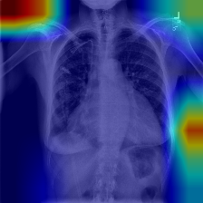 |
| Outside#2 | 00000211_014.png | Infiltration | 0.653 | 1.00 | 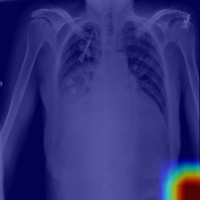 |
| Outside#3 | 00000211_015.png | Infiltration | 0.696 | 1.00 | 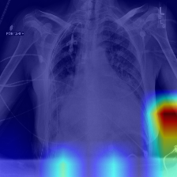 |
| Outside#4 | 00000211_016.png | Infiltration | 0.789 | 1.00 | 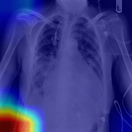 |
| Outside#5 | 00000211_017.png | Infiltration | 0.817 | 1.00 | 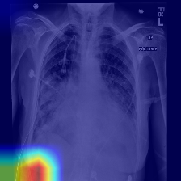 |

### 4.2 분석

**동일 환자 반복 패턴**

- 5건 모두 동일 환자(00000211)의 연속 촬영 이미지이다.
- 모두 Infiltration으로 예측되었으며, 예측 확률은 0.594~0.817 범위이다.

**가장자리 비율 100%**

- 모든 케이스에서 가장자리 비율이 1.00으로, 모델의 활성화가 전적으로 폐 영역 외부에 위치한다.
- 모델이 폐 영역이 아닌 가장자리(뼈 윤곽, 의료기기 부착 부위, 횡격막 하부)를 보고 판단하고 있다.

**원인 추정**

- 해당 환자의 이미지에 의료기기(튜브, 카테터 등)가 부착되어 있어, 이러한 인공물(artifact)이 Infiltration과 유사한 패턴으로 인식될 가능성이 있다.
- 환자의 체위(positioning) 또는 촬영 각도가 일반적인 PA(후전방) 촬영과 다를 수 있으며, 이로 인해 폐 영역의 위치가 모델의 학습 분포에서 벗어날 수 있다.
- 연속 촬영 이미지에서 일관되게 동일한 오류 패턴이 관찰되는 것은 환자 고유의 이미지 특성이 체계적으로 잘못된 활성화를 유발하고 있음을 시사한다.

---

## 5. Shortcut Learning 분석

Shortcut Learning이란 모델이 질환 자체의 영상의학적 소견이 아닌, 데이터에 내재된 통계적 상관관계(예: 의료기기 존재, 특정 촬영 조건)를 학습하여 예측하는 현상이다.

### 5.1 Shortcut Learning 징후

| 항목 | 관찰 내용 | 심각도 |
|------|----------|--------|
| 폐 영역 이탈 5건 | 모두 동일 환자(00000211), 가장자리 비율 100% | 높음 |
| 뼈 윤곽 활성화 | 일부 케이스에서 갈비뼈, 쇄골 부위에 활성화 집중 | 중간 |
| 의료기기 부위 활성화 | 튜브, 카테터 부착 위치에 활성화 관찰 | 중간 |
| 횡격막 하부 활성화 | FN 케이스 일부에서 횡격막 아래 영역에 활성화 | 낮음 |

### 5.2 환자별 편향

- 폐 영역 이탈 케이스 5건이 모두 동일 환자(00000211)에서 발생하였다.
- 이는 환자별 이미지 특성(의료기기 부착, 촬영 포지셔닝, 체형)이 shortcut으로 작용할 수 있음을 보여준다.
- 또한 FP 분석에서도 동일 환자(00000211)의 Cardiomegaly FP 2건이 확인되어, 해당 환자의 이미지가 여러 질환에 걸쳐 체계적 오류를 유발하고 있다.

### 5.3 종합 평가

- **전반적 수준**: 대부분의 FP 케이스에서 가장자리 비율이 낮아(0.00~0.15), 모델이 전반적으로 폐 영역을 적절히 주목하고 있다. Shortcut learning이 전체 모델 성능에 심각한 영향을 미치는 수준은 아니다.
- **국소적 문제**: 특정 환자(00000211)의 반복 촬영 이미지에서 비폐 영역 의존 경향이 뚜렷하다. 이는 해당 환자의 이미지 특성이 shortcut으로 작용한 사례이다.
- **결론**: 전반적으로 shortcut learning이 심각하지는 않으나, 특정 환자의 반복 촬영 이미지에서 비폐 영역에 대한 의존 경향이 확인되어, 폐 영역 마스킹 등의 추가 대책이 이러한 케이스를 개선할 수 있을 것으로 판단된다.

---

## 6. 에러 케이스 공통 패턴 및 개선 방향

### 6.1 공통 패턴

#### 패턴 1: NIH 라벨 노이즈

NIH ChestX-ray14 데이터셋은 영상의학 보고서에서 NLP 기반 자동 라벨링으로 생성되었으며, 라벨 정확도는 약 90% 수준으로 보고되어 있다. 분석된 FP/FN 케이스 중 일부는 모델의 예측이 틀린 것이 아니라 실제 라벨 자체에 오류가 존재할 가능성이 있다. 특히 높은 확신도(0.96 이상)의 FP 케이스는 라벨 오류 가능성을 재검토할 필요가 있다.

#### 패턴 2: Multi-label 중첩

흉부 X-ray에서는 여러 질환이 동시에 존재하는 경우가 빈번하다. 예를 들어 무기폐(Atelectasis)와 흉수(Effusion)가 동시에 존재하는 이미지에서 개별 질환의 영상학적 패턴이 중첩되어, 모델이 특정 질환의 특징만을 분리하여 인식하기 어려울 수 있다.

#### 패턴 3: 미세 병변의 인식 한계

작은 결절(Nodule)이나 초기 단계의 폐렴(Pneumonia) 등 미세한 병변은 224px 해상도의 입력 이미지에서 유의미한 특징으로 추출되기 어렵다. DenseNet-121의 입력 크기(224x224)에서는 특히 이러한 한계가 두드러지며, EfficientNet-B4의 380x380 입력이 일부 개선을 제공하지만 근본적 해결에는 한계가 있다.

#### 패턴 4: 환자별 편향

동일 환자의 연속 촬영 이미지에서 일관된 오류 패턴이 관찰된다. 이는 학습 데이터에서 환자 단위 분할(patient-level split)을 적용하더라도, 추론 시 특정 환자의 고유한 이미지 특성(체형, 의료기기, 촬영 조건)이 체계적 오류를 유발할 수 있음을 보여준다.

### 6.2 개선 방향

| 방향 | 방법 | 기대 효과 |
|------|------|-----------|
| 라벨 정제 | 전문의 검수 데이터셋(예: CheXpert의 전문의 consensus 라벨) 활용 | 라벨 노이즈로 인한 FP/FN 감소 |
| 해상도 향상 | 380px 이상의 고해상도 입력으로 미세 병변 인식력 향상 | FN 감소, 특히 미세 병변 검출률 향상 |
| 어텐션 메커니즘 | SE-Net 등 채널 어텐션을 통해 폐 영역에 대한 집중도 향상 | 폐 영역 이탈 케이스 감소 |
| 폐 영역 마스킹 | 폐 세그멘테이션 모델을 전처리에 추가하여 비폐 영역 제거 후 추론 | Shortcut learning 억제, 가장자리 활성화 방지 |

### 6.3 에러 유형별 개선 매핑

| 에러 유형 | 주요 원인 | 우선 개선 방향 |
|-----------|----------|---------------|
| FP (Atelectasis) | 유사 패턴 혼동, 라벨 노이즈 | 라벨 정제, 임계값 최적화 |
| FP (Cardiomegaly) | 경계선 심장 크기 | 라벨 정제, 전문의 재검토 |
| FN (전체) | 폐 영역 미주목, 미세 병변 | 폐 영역 마스킹, 해상도 향상 |
| 폐 영역 이탈 | 의료기기/포지셔닝 artifact | 폐 영역 마스킹, 어텐션 메커니즘 |

---

## 참고 사항

- Grad-CAM 이미지 경로: `outputs/gradcam_errors/`
- 에러 분석 데이터: `error_analysis.json`
- 모델: DenseNet-121 (fold 0, Test AUROC 0.8351) + EfficientNet-B4 (fold 3, Pair 기준 DenseNet f0 + B4 f3 = Test AUROC 0.8464)
- 앙상블 AUROC: 0.8520 (Soft Voting)
